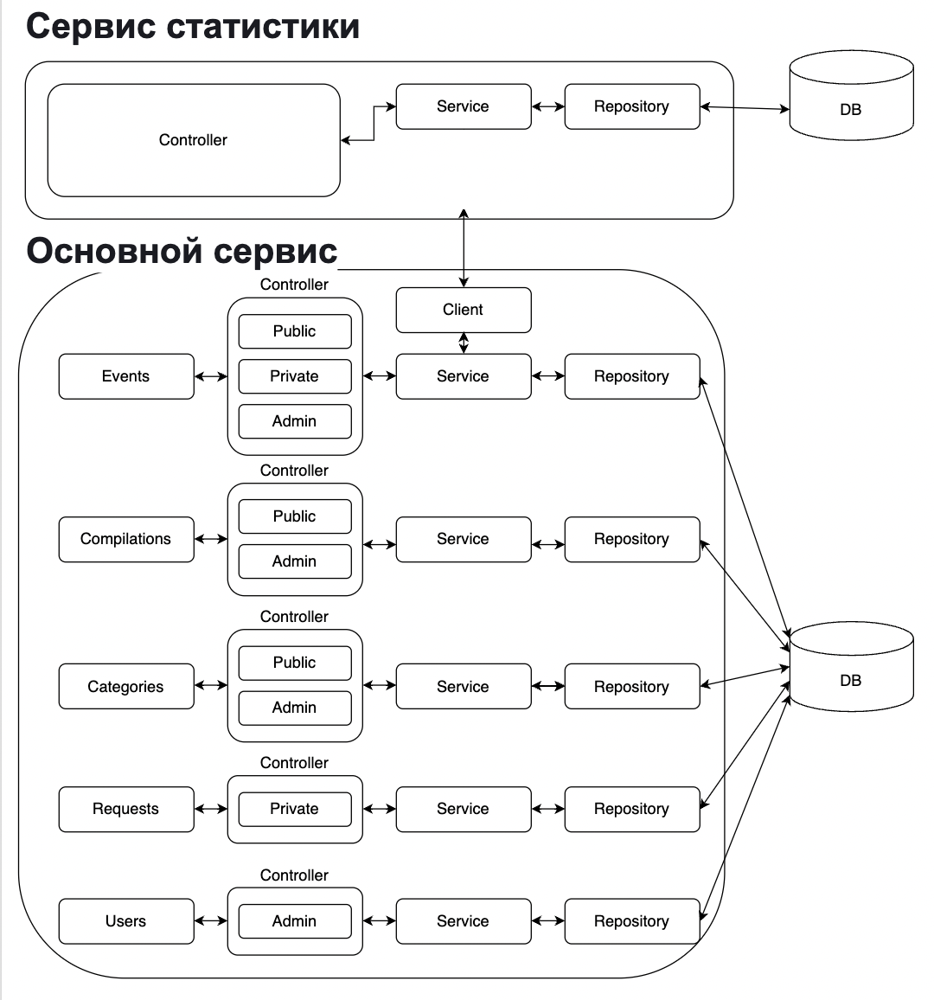
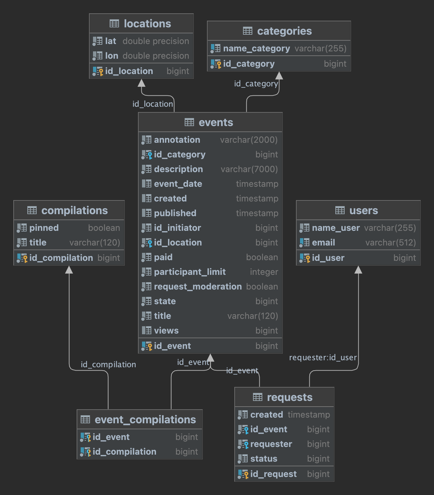
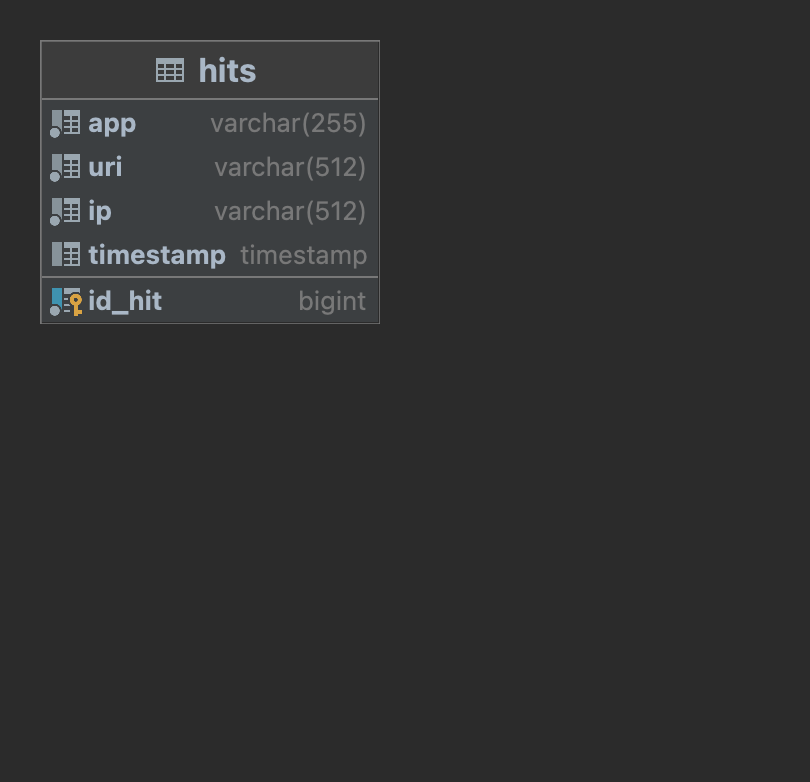

# java-explore-with-me : https://github.com/AnastasiaKuznetsova2806/java-explore-with-me/pull/1

Бэкенд для сервиса, который будет давать возможность делиться информацией 
об интересных событиях и помогать найти компанию для участия в них.

### Сервис состоит:
1. *Main-service* - содержит всё необходимое для работы продукта. Состоит из 3х частей:
   - Публичная - доступна без регистрации любому пользователю сети. Предоставляет возможности поиска и фильтрации событий.
   - Закрытая - доступна только авторизованным пользователям. Авторизованные пользователи имеют возможность:
        - добавлять в приложение новые мероприятия, редактировать их и просматривать после добавления;
        - работать с заявками на участие в интересующих мероприятиях;
        - подтверждать заявки, которые отправили другие пользователи сервиса.
   - Административная - для администраторов сервиса раззаботана возможность:
        - добавлять, изменять и удалять категорий для событий;
        - добавлять, удалять и закреплять на главной странице подборки мероприятий;
        - осуществлять модерацию событий, размещённых пользователями, — публикация или отклонение;
        - добавлять, просматривать и удалять пользователей.


2. *Stat-service* — хранит количество просмотров и позволяет делать различные выборки для анализа работы приложения.
   Призван собирать информацию. Во-первых, о количестве обращений пользователей к спискам событий и, во-вторых, о количестве запросов к подробной информации о событии.

### Архитектура проекта:

   

Для создания баз данных использована СУБД PostgreSQL.
 #### Схемы баз данных :

#####  Main-service:
   
   

USERS
- ID_USER - идентификатор пользователя (первичный ключ);
- NAME_USER - имя пользователя;
- EMAIL - электронная почта;

CATEGORIES
- ID_CATEGORY - идентификатор категории (первичный ключ);
- NAME_CATEGORY - наименование категории;

LOCATIONS
- ID_LOCATION - идентификатор локации (первичный ключ);
- LAT - широта;
- LON - долгота;

EVENTS
- ID_EVENT - идентификатор события (первичный ключ);
- ANNOTATION - краткое описание;
- ID_CATEGORY - идентификатор категории (соответствует ID_CATEGORY в таблице CATEGORIES);
- DESCRIPTION - полное описание события;
- EVENT_DATE - дата и время на которые намечено событие;
- CREATED - дата и время создания события;
- PUBLISHED - дата и время публикации события;
- ID_INITIATOR - идентификатор пользователя (соответствует ID_USER в таблице USERS);
- ID_LOCATION - идентификатор локации (соответствует ID_LOCATION в таблице LOCATIONS);
- PAID - нужно ли оплачивать участие;
- PARTICIPANT_LIMIT - ограничение на количество участников. Значение 0 - означает отсутствие ограничения;
- REQUEST_MODERATION - нужна ли пре-модерация заявок на участие;
- STATE - список состояний жизненного цикла события;
- TITLE - заголовок;
- VIEWS - количество просмотрев события;

COMPILATIONS
- ID_COMPILATION - идентификатор подборки событий (первичный ключ);
- PINNED - закреплена ли подборка на главной странице сайта;
- TITLE - заголовок подборки;

REQUESTS
- ID_REQUEST - идентификатор запроса на участие в событии (первичный ключ);
- CREATED - дата и время создания запроса;
- ID_EVENT - идентификатор события (соответствует ID_EVENT в таблице EVENTS);
- REQUESTER - идентификатор пользователя (соответствует ID_USER в таблице USERS);
- STATUS - статус заявки;

#####  Stat-service
   
   

HITS
- ID_HIT - идентификатор записи (первичный ключ);
- APP - идентификатор сервиса для которого записывается информация;
- URI - URI для которого был осуществлен запрос;
- IP - IP-адрес пользователя, осуществившего запрос;
- TIMESTAMP - дата и время, когда был совершен запрос к эндпоинту;

Для того чтобы создать таблицу USERS нужно выполнить запрос:

```create table if not exists USERS
(
    ID_USER   bigint generated by default as identity not null,
    NAME_USER varchar(255)                            not null,
    EMAIL     varchar(512)                            not null,
    constraint PK_USERS primary key (ID_USER),
    constraint UQ_USERS_EMAIL unique (EMAIL)
); ```


